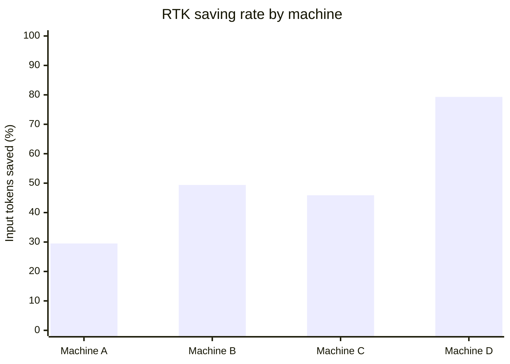

# RTK Results

This page records RTK usage from four anonymized machines associated with three
users. It is a local usage snapshot, not a benchmark or a promise of a fixed
financial saving.

> [!IMPORTANT]
> **RTK is a context guardrail first**
>
> RTK removes repetitive or oversized shell output before it reaches the model.
> The direct result is fewer input tokens. The practical result is a cleaner
> context, fewer avoidable compactions, and less risk that one large command
> displaces the information the model still needs.

## Snapshot

All four exports report RTK `0.42.4`.

| Metric | Combined result |
| --- | ---: |
| Machines | 4 |
| Users | 3 |
| Commands processed | 54,911 |
| Input tokens before RTK | 657.0M |
| Output tokens after RTK | 168.3M |
| Tokens saved | 488.8M |
| Weighted saving rate | 74.4% |
| Recorded execution time | 19h 10m 32s |

The combined rate is weighted by input tokens. It is not the average of the four
machine percentages.

## Machine Results

| Machine | Usage window | Commands | Input | Saved | Saving rate |
| --- | --- | ---: | ---: | ---: | ---: |
| Machine A | Aug 29 to Sep 10, 2026 | 2,503 | 11.3M | 3.3M | 29.5% |
| Machine B | Jun 23 to Sep 12, 2026 | 1,360 | 1.3M | 648.1K | 49.4% |
| Machine C | Jun 10 to Sep 7, 2026 | 15,141 | 78.8M | 36.2M | 45.9% |
| Machine D | Jun 15 to Sep 12, 2026 | 35,907 | 565.6M | 448.6M | 79.3% |

The exports cover June 10 to September 12, 2026. They do not by themselves
measure the period before June 10, even if RTK was installed earlier.

## Distribution

The four machine-level saving rates are:

- minimum: 29.5%.
- first quartile: 37.7%.
- median: 47.7%.
- mean: 51.0%.
- third quartile: 64.4%.
- maximum: 79.3%.

These quartiles are descriptive only. Four machines are enough to show that the
result is not tied to one setup, but not enough to support a population estimate.

The total saved-token chart is less useful as a visual comparison because
Machine D accounts for most of the observed volume. The table above preserves
those totals without hiding the smaller samples.

## What The Numbers Show

### A large-output safeguard

The strongest results come from commands that would otherwise produce very large
outputs. In the supplied exports, examples include:

- `rtk json` on the development VM: 1.8M tokens saved across three commands.
- `rtk grep` on Machine D: 144.0M tokens saved across 1,840 commands.
- `rtk read` on Machine C: 20.4M tokens saved across 151 commands.
- `rtk ls` on Machine D: 147.4M tokens saved across 472 directory listings.

The exact command mix differs by machine. That is expected: RTK is most valuable
when the shell would otherwise return repetitive, generated, or unexpectedly large
content.

### Why context quality matters

Tokens saved are not only a billing metric. A command that returns millions of
tokens can crowd out the task, instructions, and recent decisions in one step.
RTK limits that damage by returning a compact representation while preserving the
information needed to continue the task.

That can lead to a compound effect:

1. The model receives less irrelevant output.
2. The useful context remains available for longer.
3. Compaction happens later or retains a better signal-to-noise ratio.
4. Fewer follow-up messages may be needed to recover the intended direction.
5. The workflow uses fewer tokens and can cost less.

The exports directly prove the first and fifth points. The effects on compaction,
number of messages, and task quality are strong operational hypotheses, but they
were not measured by these RTK reports. They should be described as benefits of the
workflow, not as controlled experimental results.

## Interpreting Cost

The reports measure tokens, not money. A precise dollar estimate would require the
provider, model, input-token price, cache policy, and billing period for every
command.

The defensible statement is:

> The four snapshots avoided approximately 488.8M input tokens before those tokens
> reached the model. That reduces billable input volume when the provider bills
> those tokens, while also protecting the context window from oversized command
> output.

Do not turn `74.4%` into a claim that an OpenAI subscription costs `74.4%` less.
RTK changes the token stream, not every part of a provider bill.

## Limitations

- The snapshots are from four machines and three users, with different command
  mixes and activity levels.
- Two usage profiles are intensive, while the profiles are not normalized here.
- The exports span different numbers of active days.
- The supplied exports all report `0.42.4`. Earlier versions are not represented.
- There is no no-RTK control group for measuring task quality, compaction frequency,
  or messages avoided.
- The command-level ranking is a ranking of saved tokens, not a ranking of command
  importance.

These limitations do not weaken the observed token totals. They define what those
totals can and cannot prove.

## Reproduce Or Update

Use RTK's own reporting commands on each machine and preserve the export date,
version, and scope. Add a new snapshot rather than replacing the previous one when
tracking changes over time.

For installation and the OpenCode integration, see the
[RTK section in INSTALLATION.md](./INSTALLATION.md#rtk). For the upstream command
surface and current behavior, use the [official RTK README](https://github.com/rtk-ai/rtk).
